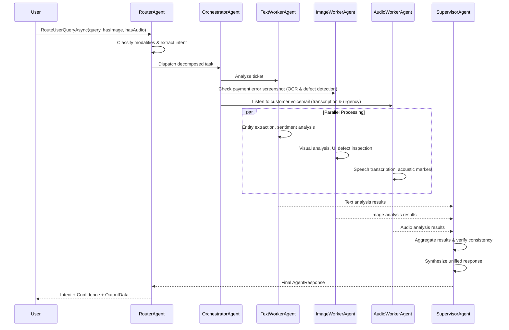

# A2A Multi-Agent Framework (.NET 9 C# Reference Solution)

This project demonstrates an enterprise-grade **Agent-to-Agent (A2A)** multi-agent application in C# using Microsoft's Agent Framework & Semantic Kernel design patterns.

## Architecture & Agent Roles
1. **RouterAgent**: Evaluates incoming multimodal requests and classifies required modalities.
2. **OrchestratorAgent**: Decomposes the task and dispatches parallel A2A messages via async channels.
3. **TextWorkerAgent**: Analyzes text content, sentiment, entity extraction, and reasoning.
4. **ImageWorkerAgent**: Analyzes visual images, OCR extraction, and UI defect inspection.
5. **AudioWorkerAgent**: Analyzes speech transcripts, acoustic urgency markers, and audio metadata.
6. **SupervisorAgent**: Aggregates all worker results, verifies cross-modal consistency, and synthesizes the unified final response.

## Execution Flow

The following sequence diagram illustrates how the multi-agent system processes a multimodal user query:



## Quick Start
```bash
# 1. Restore NuGet dependencies
dotnet restore

# 2. Build and execute the sample A2A workflow
dotnet run
```
